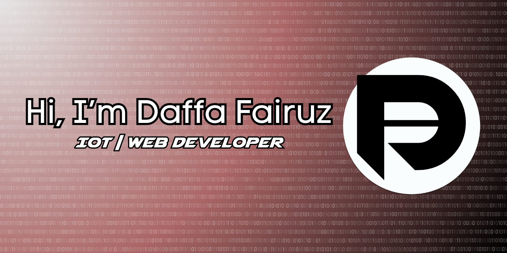

## Hi Guys, I'm Daffa Fairuz 👋

---

##### I'm a Web Developer and IoT Engineer in the making, dedicated to building clean, scalable web applications while learning and experimenting with IoT solutions.

### 🚀 About Me
- 🔭 I’m currently working on: **My Personal Portfolio Website**  
- 🌱 I’m currently learning: **Vue.js, Filament, and RESTful API Design**
- 👯 I’m looking to collaborate on: **Open-source web development projects**
- 🤔 I’m looking for help with: **Improving UI/UX and frontend performance**
- 💬 Ask me about: **Laravel, Tailwind CSS, Bootstrap, MySQL, ESP32 (IoT)**
- 📫 How to reach me: **daffafairuzannizari@gmail.com**
- 😄 Pronouns: **He/Him**
- ⚡ Fun fact: I love building projects that automate daily life (IoT + Web)

---

### 📖 Skill

  
  
  
  
  
  
  
  

### 📖 Social Media

  
  
  

### 📊 My Github Stat

  

  
  

---

### 📌 Featured Projects
- 🔹 **Personal Portfolio Website** – Laravel + Tailwind CMS  
- 🔹 **Student Management System** – CRUD lengkap + autentikasi  
- 🔹 **IoT: Smart Room Monitoring (ESP32 + MQTT)**

---

### Play Game

> 💡 *Feel free to explore my repositories. I love building projects and learning new things every day!*

